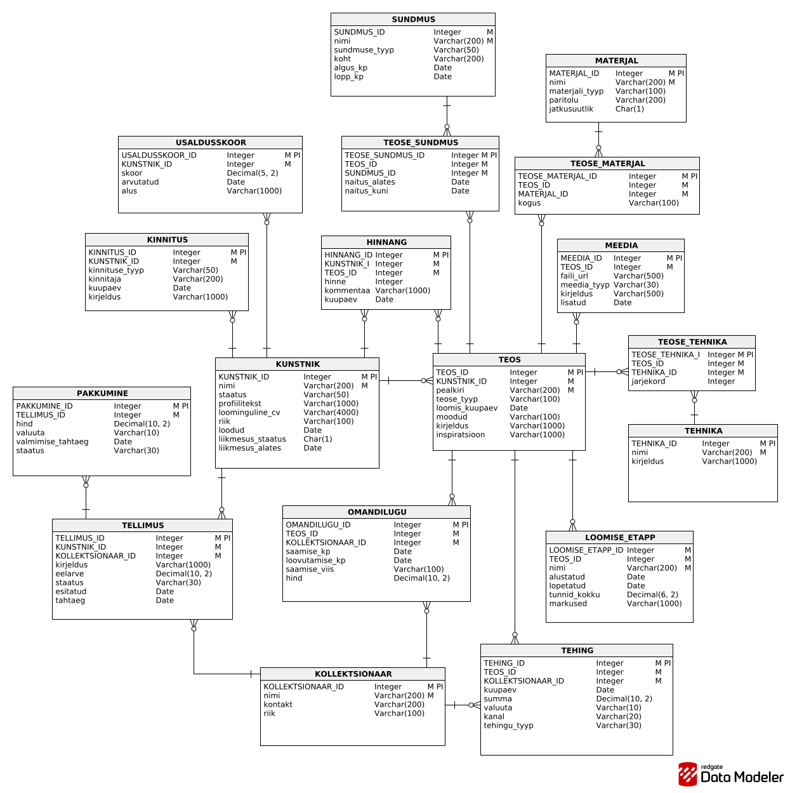

# Wearable Art Archive

A searchable archive of wearable art (garments, jewellery, headwear and accessories) that records who made each piece, what it is made of, which techniques were used, and how many hours went into it.

It started as a database course project at TalTech (ICA0005, designed in Oracle) and now runs as a Next.js app on PostgreSQL.

## What it does

- **Search everything at once.** Titles, makers, types, materials, techniques and descriptions are combined into one weighted full-text document per piece. Search uses both a plain and an English dictionary, so "dresses" finds "dress", and falls back to trigram similarity, so typos still match.
- **Filter** by category, type, material, technique, or "sustainable materials only".
- **Artwork pages** show materials with their origin and a sustainability flag, techniques in order, creation stages with hours, exhibitions, reviews, and the image credit.
- **Artists**: contemporary studio profiles (demo data from the course project) with endorsements, reviews and a trust score, next to the historic makers from the museum archive.
- **Types**: a fixed set of standard types, plus types added by artists that always sit under a standard type so filters keep working. Visitors can suggest a new type.
- **Commissions**: a request form on studio profiles, built around the idea of ordering one lasting piece from a person rather than a factory.

Public forms only write to a `submission` review queue (honeypot, 5 per hour per visitor, IP stored only as a salted hash). Nothing a visitor sends is published automatically.

## Data

- **Archive pieces**: The Metropolitan Museum of Art [Open Access](https://www.metmuseum.org/about-the-met/policies-and-documents/open-access) (CC0), collected with `scripts/harvest-met.mjs`. Images are resized to WebP and served from `public/images/archive`. Each piece links back to its museum record.
- **Studio profiles, commissions, transactions and trust scores**: the example data from the course project, translated and corrected. They are marked as demo profiles on the site.

## The schema

21 tables from the course project plus a review queue, in [`db/schema.sql`](db/schema.sql). The original design used Estonian names:

| Course project (Oracle) | PostgreSQL       | Holds                                 |
| ----------------------- | ---------------- | ------------------------------------- |
| KUNSTNIK                | `artist`         | Artists and studios                   |
| TEOS                    | `artwork`        | The wearable pieces                   |
| TEOSE_TYYP              | `artwork_type`   | Standard types (dress, brooch…)       |
| UUS_TEOSE_TYYP          | `custom_artwork_type` | Types added by artists           |
| MATERJAL                | `material`       | Materials, origin, sustainability     |
| TEHNIKA                 | `technique`      | Techniques                            |
| TEOSE_MATERJAL          | `artwork_material` | Which materials, how much           |
| TEOSE_TEHNIKA           | `artwork_technique` | Which techniques, in what order    |
| LOOMISE_ETAPP           | `creation_stage` | Making stages and hours               |
| MEEDIA                  | `media`          | Photos and their credits              |
| SUNDMUS                 | `event`          | Exhibitions, galleries, runway shows  |
| TEOSE_SUNDMUS           | `artwork_event`  | Where a piece was shown               |
| KOLLEKTSIONAAR          | `collector`      | Buyers and collectors                 |
| TELLIMUS                | `commission`     | Commission requests                   |
| PAKKUMINE               | `offer`          | The artist's offers                   |
| TEHING                  | `transaction`    | Payments; traces ownership            |
| TEHINGU_TYYP            | `transaction_type` | Deposit, sale, fee                  |
| KINNITUS                | `endorsement`    | Professional endorsements             |
| KINNITUSE_TYYP          | `endorsement_type` | Education, exhibition, curator      |
| HINNANG                 | `review`         | Community reviews                     |
| USALDUSSKOOR            | `trust_score`    | Trust score over time                 |



### What changed in the port

- The original scripts didn't run as written: inserts referenced columns that didn't exist and put NULL into required foreign keys. Every constraint now holds.
- A review is about an artist **or** an artwork (a CHECK constraint) instead of requiring both.
- Join tables use the (artwork, material) pair as the primary key instead of a surrogate id plus a composite key.
- Countries are ISO codes; statuses and event types are checked against fixed lists; date ranges can't end before they start.
- Ownership history is traced through commissions and transactions, as the course project concluded, so the early `OMANDILUGU` table is gone.
- Search is a materialized view (`artwork_search`) with GIN indexes on a weighted `tsvector` and on trigrams.

## Stack

Next.js 16 (App Router, Server Components, Server Actions) · TypeScript · PostgreSQL 18 on [Neon](https://neon.tech) (free tier; scales to zero and wakes on the next request) · `@neondatabase/serverless` HTTP driver · deployed on Vercel.

## Run it

```bash
npm install
# .env.local: DATABASE_URL=postgresql://…
node scripts/db.mjs db/schema.sql db/seed-reference.sql db/seed-studio.sql db/seed-archive.sql
npm run dev
```

To rebuild the archive data: `node scripts/harvest-met.mjs` (slow on purpose, about one request a second) then `node scripts/build-archive-seed.mjs`.
